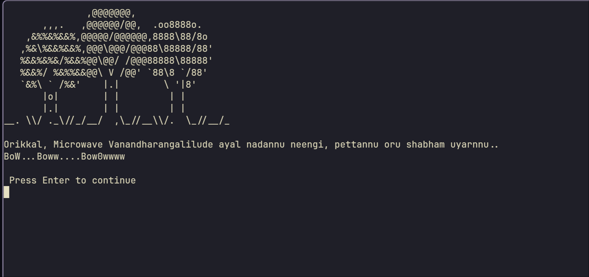
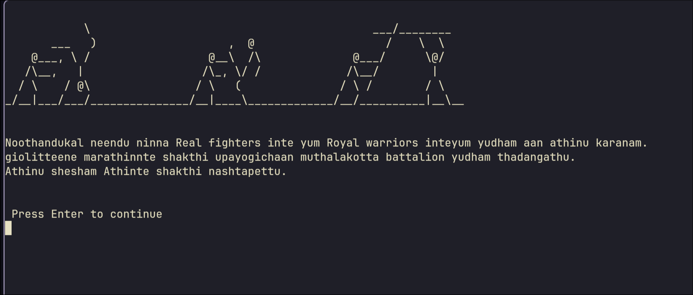
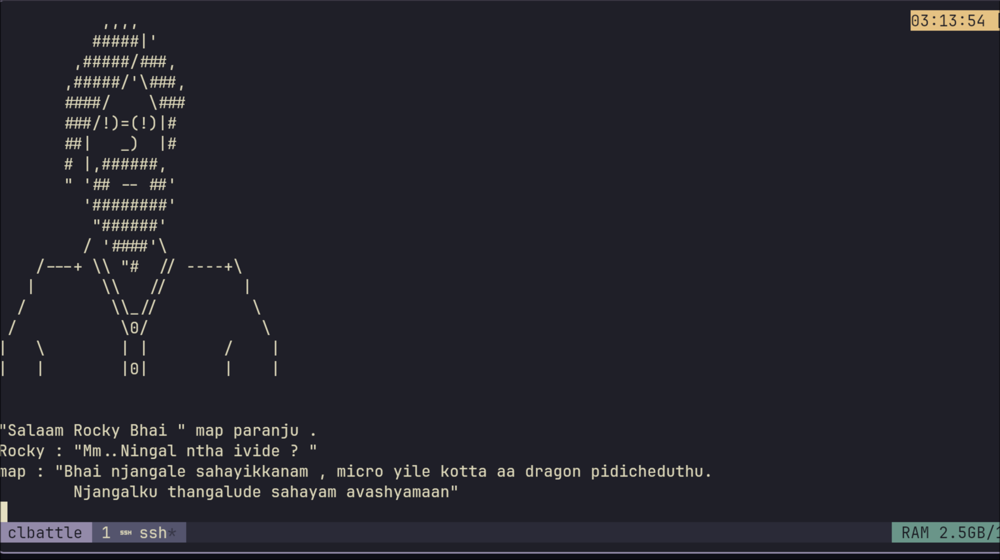

# CL Battle

**CL Battle** is a series of basic linux command challenges.<br>
Each level is cleared when password for the next level is found .
<br><br>




## Installation
- clone the repo<br>

Run the build script

```bash
chmod +x ./build.sh
./build.sh
```

Or pull remote docker image 

```bash
    docker pull v4zha/wargame:latest
```
then run the container

```bash
    docker run -p 2020:22 --rm -d --name clbattle --hostname clbattle v4zha/wargame:latest
```

Connecting to Each level 

``` bash
ssh lvl0@127.0.0.1 -p 2020
```

## Note
- Basic obfuscation,security and file permission restriction is not implemented as it is intented to be beginner friendly and not competetive.
